# RoyaLab

RoyaLab is a responsive Clash Royale companion web application built with React and Firebase/Firestore.

The application allows users to explore Clash Royale cards, build and save decks, analyze card statistics, and share community balance suggestions.

---

## Features

- Browse Clash Royale cards
- Search cards by name
- Filter cards by rarity
- Filter cards by arena
- Filter cards by evolution availability
- Sort cards by win rate, use rate, and elixir cost
- View card statistics
- View card evolution images
- Build custom 8-card decks
- Prevent duplicate cards in decks
- Calculate average deck elixir
- Display the deck elixir curve using charts
- Save decks to Firebase Firestore
- Update saved decks
- Delete saved decks
- Create community balance suggestions
- Vote on community suggestions
- Responsive design for different screen sizes
- Interactive card animations and page transitions

---

## Technologies Used

- React
- JavaScript
- HTML
- CSS
- Firebase
- Firestore
- React Router
- React Hook Form
- Recharts
- Lucide React
- React Toastify
- Vite
- Netlify

---

## Screenshots

### Home Page

<p align="center">
  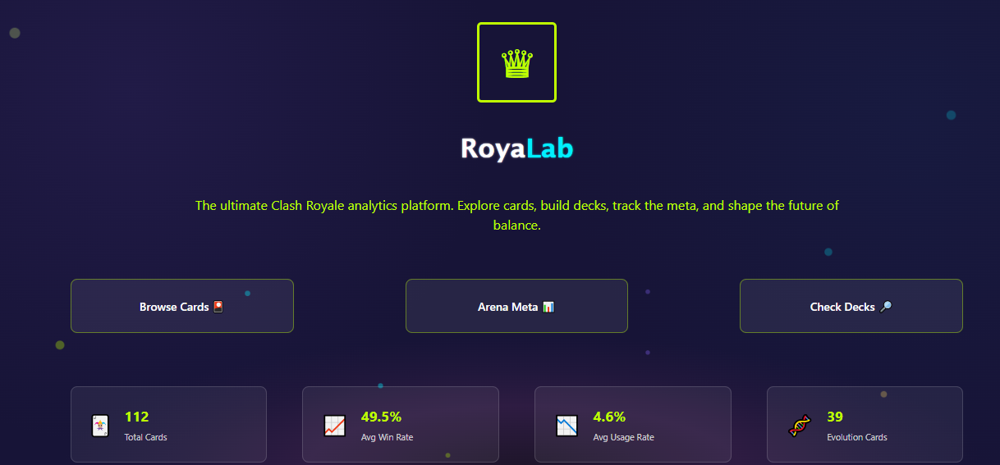
  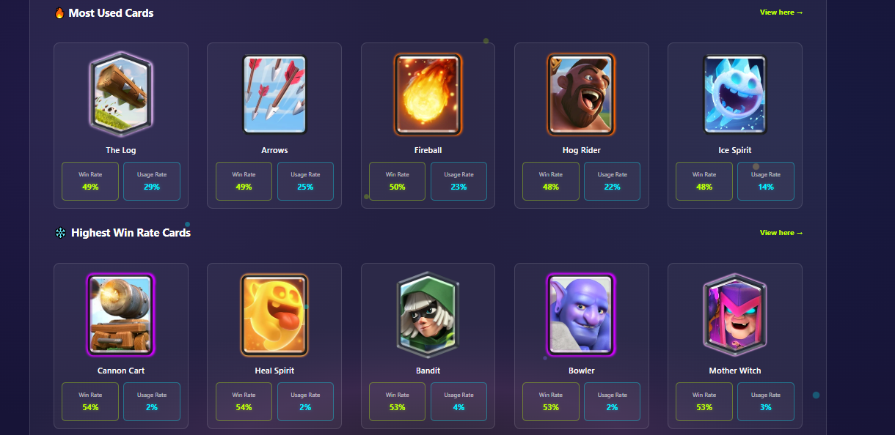
</p>

### About Page

<p align="center">
  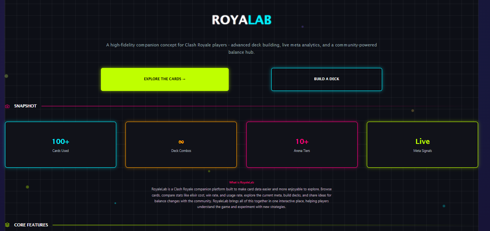
  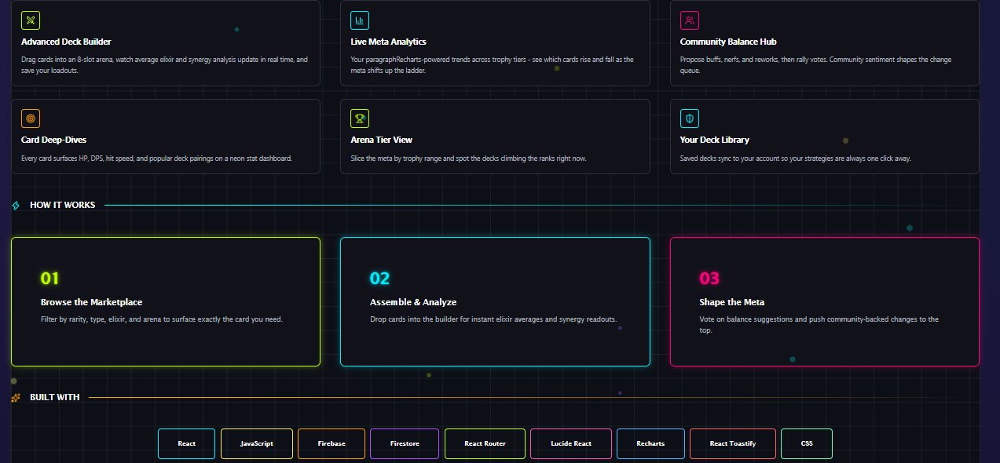
</p>

### Cards Explorer

<p align="center">
  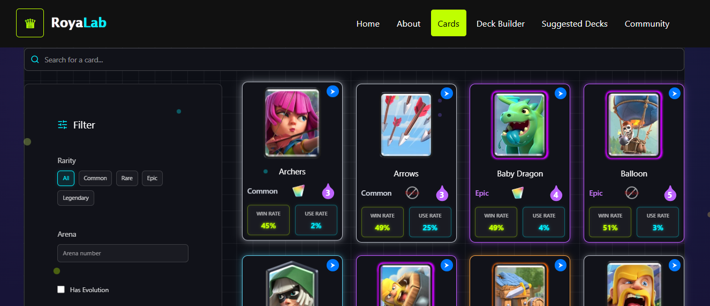
  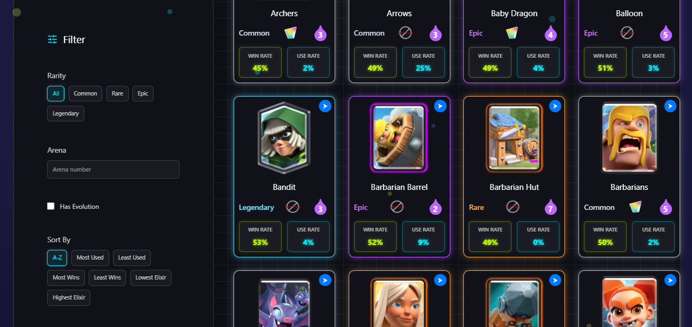
</p>

### Deck Builder

<p align="center">
  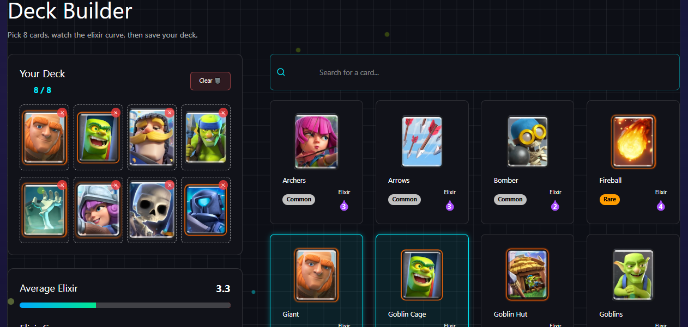
  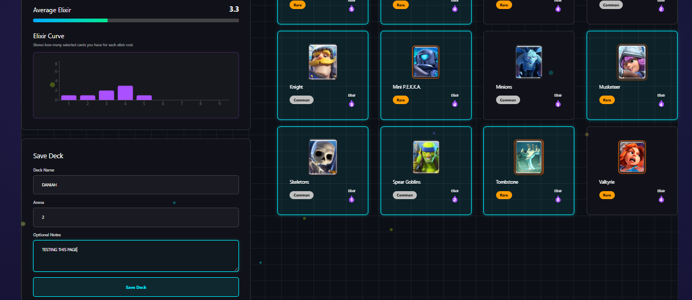
</p>

### Saved Decks

<p align="center">
  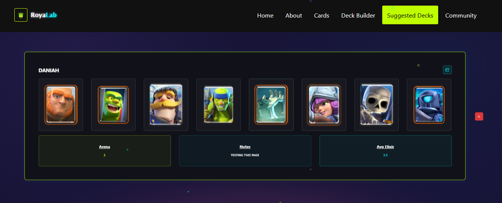
</p>

### Community Suggestions

<p align="center">
  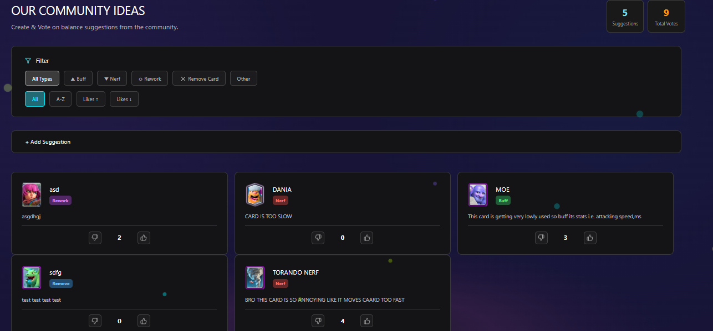
  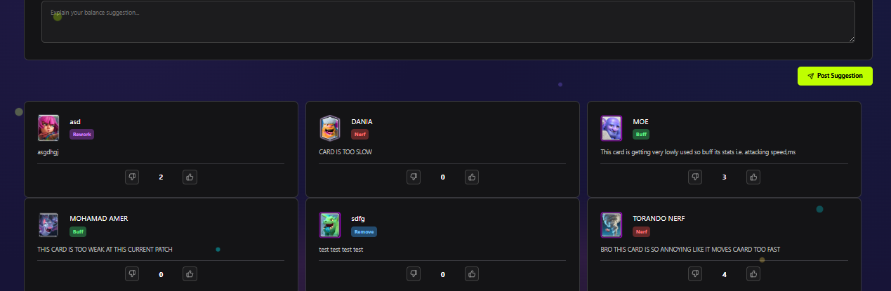
</p>

---

## Main Pages

### Home

The Home page introduces RoyaLab and provides quick access to the main features of the application.

It also displays card statistics and highlights cards based on their win rate and use rate.

---

### About

The About page introduces RoyaLab and explains the main idea behind the project, its purpose, and the features available in the application.

It also presents the technologies, libraries, and tools used to build the project, including React, Firebase/Firestore, React Router, Recharts, Lucide React, React Toastify, JavaScript, HTML, CSS, Vite, and Netlify.

---

### Cards Explorer

The Cards page allows users to explore Clash Royale cards and filter them using several options.

Users can search for cards by name and filter them by:

- Rarity
- Arena
- Evolution availability
- Win rate
- Use rate
- Elixir cost

Cards also include interactive animations such as evolution image switching and card flipping.

---

### Deck Builder

The Deck Builder allows users to create a custom Clash Royale deck using up to 8 cards.

The application prevents duplicate cards from being added to the same deck.

It also calculates the average elixir cost of the selected cards and displays an elixir curve using Recharts.

Users can enter additional deck information such as:

- Deck name
- Arena
- Notes

The completed deck can then be saved to Firebase Firestore.

---

### Saved Decks

The Saved Decks page displays decks stored in Firestore.

Users can:

- View saved decks
- Edit deck information
- Update existing decks
- Delete decks

This section demonstrates CRUD operations with Firebase Firestore.

---

### Community

The Community page allows users to create balance suggestions for Clash Royale cards.

Suggestion types include:

- Buff
- Nerf
- Rework
- Remove
- Other

Users can also like or dislike community suggestions.

The page includes filtering and sorting options to help users browse suggestions.

---

## Firebase / Firestore

RoyaLab uses Firebase Firestore as its database.

The main Firestore collections used in the project are:

```text
cards
decks
comments